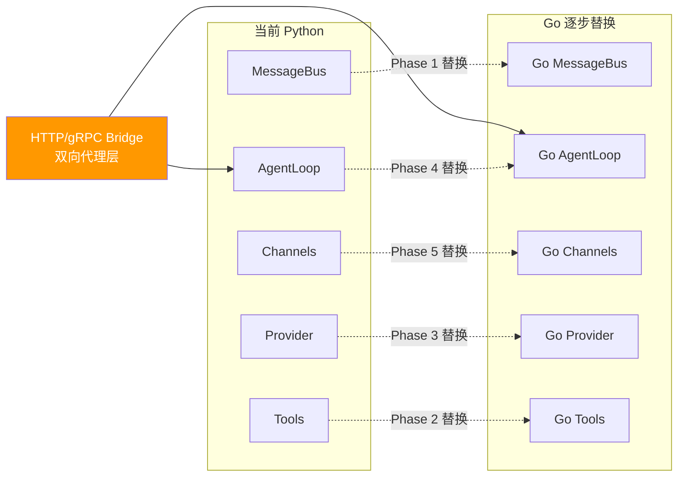

# nanobot Go 改写：TDD + 持续迁移方案

## 核心策略：Strangler Fig + 契约测试



> **原则**：每个 Phase 完成后，系统可以在 "Python + 已完成的 Go 模块" 混合模式下运行，任何时刻都可以回退。

---

## 一、TDD 方法论

### 1.1 三层测试金字塔

```
        ╱ E2E 验收测试 ╲          ← 端到端: Python 版 vs Go 版同一 prompt 对比
       ╱  契约测试 (共享)  ╲        ← 从 Python 接口 + 行为提取，Go/Python 都必须通过
      ╱  Go 单元测试 (先写)   ╲      ← TDD: 先写 Go test，再写实现
```

### 1.2 契约测试（从 Python 接口提取）

nanobot 有 3 个核心抽象接口，它们定义了模块之间的**契约**：

#### 契约 1: `Tool` 接口

```go
// internal/tools/base.go
type Tool interface {
    Name() string
    Description() string
    Parameters() map[string]any           // JSON Schema
    Execute(ctx context.Context, args map[string]any) (string, error)
}

// internal/tools/base_test.go — 契约测试套件，所有 Tool 必须通过
func RunToolContractTests(t *testing.T, tool Tool) {
    t.Run("Name is non-empty", ...)
    t.Run("Parameters is valid JSON Schema", ...)
    t.Run("ToSchema format", ...)
}
```

#### 契约 2: `Channel` 接口

```go
// internal/channels/base.go
type Channel interface {
    Name() string
    Start(ctx context.Context) error
    Stop() error
    Send(msg OutboundMessage) error
    IsRunning() bool
}
```

#### 契约 3: `LLMProvider` 接口

```go
// internal/providers/base.go
type LLMProvider interface {
    Chat(ctx context.Context, req ChatRequest) (*LLMResponse, error)
    DefaultModel() string
}
```

### 1.3 TDD 工作流（每个文件）

```
1. 写 Go _test.go (从 Python 行为提取)
2. 运行 → 红色 ❌
3. 写 Go 实现
4. 运行 → 绿色 ✅
5. 重构
6. 运行契约测试 ✅
7. 运行 E2E 对比 ✅ (如有)
```

---

## 二、持续同步上游 Python 机制

### 2.1 Git Submodule 追踪

```
nanobot-go/
├── upstream/          # git submodule → HKUDS/nanobot (Python)
├── internal/          # Go 实现
├── contracts/         # 共享测试 fixtures (JSON)
└── docs/              # 执行计划 + 迁移状态
```

### 2.2 变更检测 CI 流水线

```yaml
# .github/workflows/upstream-sync.yml
name: Upstream Sync Check
on:
  schedule: [cron: '0 8 * * *']  # 每天检查
jobs:
  check-upstream:
    steps:
      - uses: actions/checkout@v4
        with: { submodules: true }
      - name: Update upstream submodule
        run: cd upstream && git fetch origin main && git diff HEAD..origin/main --stat
      - name: Create Issue if breaking
        # 自动分类已迁移/未迁移模块变更，对已迁移模块创建 Issue
```

### 2.3 变更分类规则

| upstream 变更类型 | 影响 | 动作 |
|------------------|------|------|
| 已迁移模块的接口 (`base.py`) 变更 | 🔴 高 | 立即同步 Go 接口 + 更新契约测试 |
| 已迁移模块的实现变更 | 🟡 中 | 评估后同步到 Go |
| 未迁移模块的变更 | 🟢 低 | 无需动作，等迁移时再处理 |
| 新增模块 / 新增频道 | 🟢 低 | 加入迁移 backlog |

---

## 三、混合运行架构（Bridge 层）

Phase 2~4 期间，Go 和 Python 通过 HTTP bridge 共存：

```
Go CLI → Go MessageBus → Bridge Client →(HTTP)→ Python Bridge Server → Python AgentLoop → LiteLLM
                                    ↑                                        |
                                    └──── tool calls (Go 已实现的工具) ←──────┘
```

Bridge 在所有模块迁移完成后移除。

---

## 四、分 Phase TDD 迁移计划

### Phase 1: 基础设施 + 契约测试框架 (第 1~2 周)

| 文件 | 测试文件 | 测试先行内容 |
|------|---------|-------------|
| `bus/events.go` | `bus/events_test.go` | 序列化/反序列化、SessionKey |
| `bus/queue.go` | `bus/queue_test.go` | publish/consume 并发安全、订阅分发 |
| `config/schema.go` | `config/schema_test.go` | JSON 解析 ↔ struct、默认值 |
| `config/loader.go` | `config/loader_test.go` | 文件不存在/格式错误/正常加载 |
| `session/manager.go` | `session/manager_test.go` | JSONL 读写、get_or_create |

**里程碑**: `make test-unit` 全绿 ✅

### Phase 2: 工具系统 (第 2~4 周)

| 文件 | 测试先行内容 | 契约测试 |
|------|-------------|---------|
| `tools/shell.go` | 命令执行、超时、deny patterns | `RunToolContractTests` ✅ |
| `tools/filesystem.go` | 读/写/编辑/列表、路径安全 | ✅ |
| `tools/web.go` | URL 验证、HTML→markdown | ✅ |
| `tools/mcp.go` | MCP 连接、调用 | ✅ |

**里程碑**: Go 工具可通过 bridge 供 Python AgentLoop 调用 ✅

### Phase 3: LLM Provider (第 4~6 周)

| 文件 | 测试先行内容 |
|------|-------------|
| `providers/registry.go` | Provider 查找、模型名前缀 |
| `providers/provider.go` | Mock HTTP server 测试 + 3 个真实 Provider 集成测试 |

**里程碑**: Go Provider 通过 mock + 真实 API 测试 ✅

### Phase 4: Agent 核心 (第 5~7 周)

| 文件 | 测试先行内容 |
|------|-------------|
| `agent/memory.go` | 文件读写、MEMORY.md 追加 |
| `agent/skills.go` | 技能发现、frontmatter 解析 |
| `agent/context.go` | system prompt 构建、消息拼接 |
| `agent/loop.go` | **核心**: mock provider → tool execution → 响应 |

**里程碑**: Go AgentLoop 独立运行，移除 bridge ✅

### Phase 5: 频道集成 (第 7~9 周)

每个频道两层测试: `RunChannelContractTests` + mock server 集成测试

### Phase 6: CLI + E2E 对比 (第 9~10 周)

E2E: 同一 prompt 对比 Python 版与 Go 版输出一致性

---

## 五、Go 依赖列表

| 功能 | Go 包 | 替代的 Python 依赖 |
|------|-------|-------------------|
| CLI | `spf13/cobra` | typer |
| 终端美化 | `charmbracelet/lipgloss` | rich |
| HTTP | `net/http` (标准库) | httpx |
| WebSocket | `gorilla/websocket` | websockets |
| LLM | 直接 HTTP / OmniLLM | litellm |
| Telegram | `telebot/v4` | python-telegram-bot |
| Discord | `bwmarrin/discordgo` | discord.py |
| Slack | `slack-go/slack` | slack-sdk |
| 飞书 | `larksuite/oapi-sdk-go/v3` | lark-oapi |
| 钉钉 | `open-dingtalk/dingtalk-stream-sdk-go` | dingtalk-stream |
| Email | `emersion/go-imap` + `go-mail` | imaplib + smtplib |
| HTML 提取 | `go-shiori/go-readability` | readability-lxml |
| Cron | `robfig/cron/v3` | schedule |
| MCP | `mark3labs/mcp-go` | mcp |
| YAML | `gopkg.in/yaml.v3` | pyyaml |
| 日志 | `rs/zerolog` | loguru |
| 测试 | `stretchr/testify` | pytest |

---

## 六、关键改写模式速查

| Python 模式 | Go 等效 |
|-------------|---------|
| `@dataclass` | `type Foo struct { ... }` |
| `asyncio.Queue` | `chan Type` |
| `async def` / `await` | `go func()` / channel receive |
| `asyncio.gather()` | `errgroup.Group` |
| `try/except` | `if err != nil` |
| Pydantic `BaseModel` | struct + `json:"tag"` |
| `pathlib.Path` | `filepath.Join()` + `os` |
| Typer CLI | `cobra.Command` |
| Loguru | `zerolog` |
